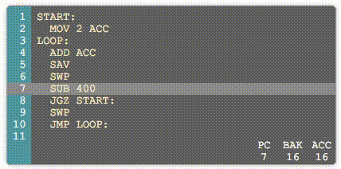

Open100
=======

Assembler interpreter written in TypeScript. 

This is a learning project for Angular2 and TypeScript development. The assembler is inspired by Zachtronics game [TIS 100](http://www.zachtronics.com/tis-100/).

